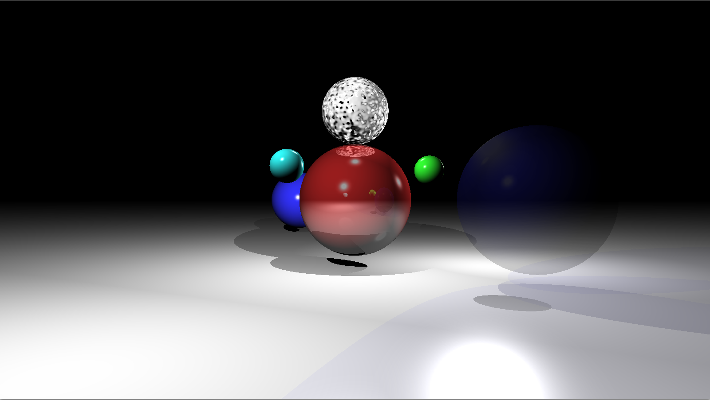

# cpp-rt

##Overview

A simple raytracer I coded for fun (also to exercise).

Few config files already available in the root directory.

Uses SFML2.x, it should compile on linux distros (Makefile).

I might work on it a bit more to add fancy features if some day I feel like it.

### raytraced image:

